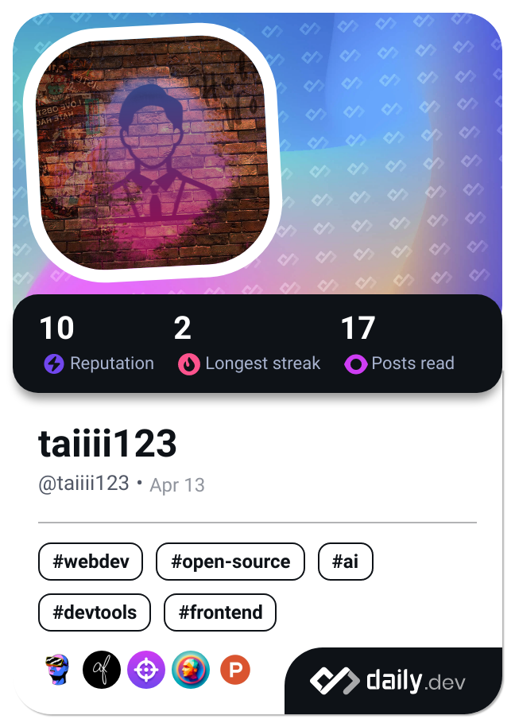

# Hello! 

## ✍️ Learning

<h3 align="left">Languages and Tools:</h3>

 
  <a href="https://www.w3.org/html/" target="_blank">  </a  
   
  
   
  <a href="https://sass-lang.com" target="_blank" rel="noreferrer">  </a  
   
   
   
   
  
   
  
   
   
   
   
   
   
   
  

## 💡Status

